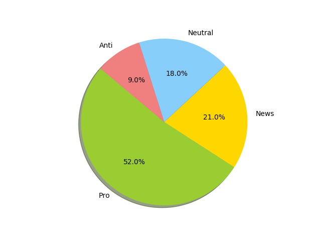

# Climate-Change-Tweets-Classifiers-Bechmark
_Project of Social Media Management (Machine Learning applied to Social Media)_ <br/>
_Grade of this project: 30 / 30_ <br/>
_Antonio Scardace_ @ _Dept of Math and Computer Science, University of Catania_

## Introduction

This project consists, given a series of tweets about Climate Change, of figuring out whether the user (the author) is a sceptic or supports the belief of man-made climate change.

To solve this problem, I have made a model (a classifier) which has been trained on a **43943 tweets** dataset collected between 2015-04-27 and 2018-02-21 by ***Canada Foundation for Innovation JELF Grant to Chris Bauch, University of Waterloo***. It has been selected on [Kaggle](https://www.kaggle.com/) and can be found [here](https://www.kaggle.com/datasets/edqian/twitter-climate-change-sentiment-dataset).

Each row of the dataset contains the text of the tweet labelled as '*message*', the tweet id labelled as '*tweetid*', and the sentiment of the tweet labelled as '*sentiment*'.

Each sentiment is labelled as one of the following classes:
- ``-1`` (**Anti**) &#8594; the tweet author doesn't believe in man-made climate change;
- ``0`` (**Neutral**) &#8594; the tweet author neither supports nor refutes the belief of man-made climate change;
- ``1`` (**Pro**) &#8594; the tweet author supports the belief of man-made climate change;
- ``2`` (**News**) &#8594; the tweet links to factual news about climate change;

Let's see how classes are distributed in the dataset. It is unbalanced.<br/>


## Machine Learning

I have designed and developed a benchmark among these basic ML classification algorithms:
1. K-Nearest Neighbors
2. Multinomial Naive-Bayes
3. Logistic Regression
4. SVM
5. SGD-Classifier

The best has been the **SVM**, with an accuracy of the **71.8%**.

All of them have been implemented using **Scikit-Learn** in **Python**. 

## Requisites

* At least 10 cores of CPU.
* I recommend to downloading, installing, and using [Conda](https://docs.conda.io/projects/conda/en/latest/user-guide/install/index.html#) that has  [Jupyter Notebook](https://jupyter.org/install) included.
* The use of [Visual Studio Code](https://code.visualstudio.com/download) is recommended.

## License

**Author**: [Antonio Scardace](https://linktr.ee/antonioscardace). <br/>
Distributed under the MIT License. See ``` LICENSE ``` for more information.
